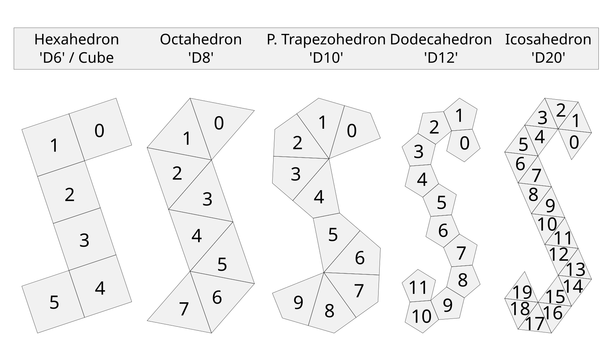

# dicefinder
Find numerically balanced dice.

## Compiling
You really want to build in release mode. -Ofast should be safe. example:
- `mkdir build && cd build`
- `cmake -G Ninja -DCMAKE_BUILD_TYPE=RELEASE -DCMAKE_CXX_FLAGS="-Ofast -flto" ..`
- `ninja`

You need a C++23-ready compiler. clang 14 and gcc 12.1 have been tested. MSVC might work, but is untested.

## Usage
Synopsis: `dicefinder [-v] [-p|--point-sdev float] [-f|--face-sdev float] <shape>`

- `shape`: Die to process. Can be `hexahedron`/`d6`, `octahedron`/`d8`, `pent_trapezohedron`/`d10`,
  `dodecahedron`/`d12`, `icosahedron`/`d20`, `rhombic_triacontahedron`/`d30`.
- `point-sdev` and `face-sdev`: Discard layouts with higher standard deviation of point and face weights, respectively.
  These may be omitted, but the d20 in particular will take quite some time to sort and print. There is no epsilon for
  comparisons, so you may want to give a slightly higher value.
- You can output progress with flag `-v` or `--print-progress`. As the d20 takes only a few seconds, this is probably
  not needed.
- The output _will_ include mirrored layouts, however it will _not_ include rotated layouts. '1' will always be the
  value on the zeroth face.

This program will evaluate every (non-rotated) layout of a given die. As the number of combinations grows rapidly, and
each layout takes longer to process, a d30 is already past the limit of what can reasonably be computed. An
untested (!) layout is included in any case.

## Included Dice
All the 'DnD Dice' are included, except for the tetrahedron/d4 (see limitations). The unwrapping of these is a spiral
peel, shown below with face indices:

The smaller dice have no 'perfect' layout, only d20.

## Limitations
- This project assumes classical dice where each pair of opposing sides gives the same sum; i.e. 1+6, 2+5, 3+4. That
  also means dice with a vertex pointing up (like the d4) aren't supported.
- Right now there is nothing like an automated importer, all shapes are compiled in. If you do want to add one
  yourself, you will have to add a `sparse_topology` manually. See `dice_definitions.hpp` for examples.
- All dice are numbered starting with, and incrementing by, 1. However, starting at a different number wouldn't
  actually change the distribution, and changing the increment would only scale it. You can just offset the face values
  generated by what you want.
